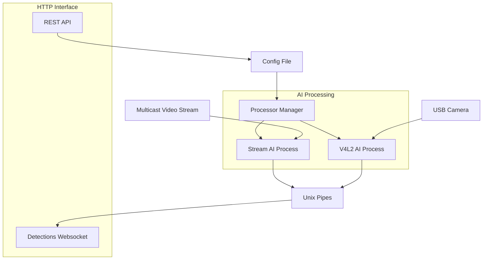

# Edge AI Video Processing

A tool for running AI models at the edge. Designed to minimize latency in processing



## Documentation

To test this out quickly, you can do the following:

```shell
git clone https://github.com/spider-gazelle/edge-ai
cd edge-ai
shards build
cp -R ./www ./bin/www
mkdir ./bin/config
```

then lookup the video hardware you have available

```shell
./bin/hw_info -v
```

this will output something like:

```text
Video Hardware
==============

* /dev/video4
  USB2.0 HD UVC WebCam: USB2.0 IR (uvcvideo)
  - GREY
    640x360 (15.0fps) [DISCRETE]

* /dev/video2
  USB2.0 HD UVC WebCam: USB2.0 HD (uvcvideo)
  - MJPG
    1280x720 (30.0fps) [DISCRETE]
    640x480 (30.0fps) [DISCRETE]
    352x288 (30.0fps) [DISCRETE]
    320x240 (30.0fps) [DISCRETE]
    176x144 (30.0fps) [DISCRETE]
    160x120 (30.0fps) [DISCRETE]
  - YUYV
    1280x720 (10.0fps) [DISCRETE]
    640x480 (30.0fps) [DISCRETE]
    352x288 (30.0fps) [DISCRETE]
    320x240 (30.0fps) [DISCRETE]
    176x144 (30.0fps) [DISCRETE]
    160x120 (30.0fps) [DISCRETE]
```

From this list you probably want to use the

* /dev/video2
* YUYV @ 640x480 (30.0fps)

Then create a config file (this can also be done via the API)
`vim ./bin/config/config.yml`

```yml
---
pipelines:
  3e8bca09-6b54-41aa-96eb-691a964adc50:
    name: web camera
    async: false
    min_score: 0.4
    track_objects: true
    input:
      type: video_device

      # update these as required
      path: /dev/video2
      width: 640
      height: 480
      format: YUYV

      # this multicast stream is used for confidence monitoring
      multicast_ip: 224.0.0.1
      multicast_port: 5000
    output:
    - type: "face_detection"

      # this is a back of phone NN model
      # so expects faces to be a little further away from the camera
      model_uri: "https://raw.githubusercontent.com/patlevin/face-detection-tflite/main/fdlite/data/face_detection_back.tflite"
      scaling_mode: "cover"
      strides: [16, 32, 32, 32]
      gpu_delegate: false
      # tpu_delegate: /sys/bus/usb/devices/4-3
      warnings: []
      pipeline: [
        {
          "type": "gender_estimation",
          "model_uri": "https://os.place.tech/neural_nets/gender/model_lite_gender_q.tflite",
          "scaling_mode": "cover"
        }
      ]
    id: 3e8bca09-6b54-41aa-96eb-691a964adc50
    updated: 2023-12-06 12:40:19.945720369+11:00

```

then you can launch the processes: `cd bin`

* `./processor` - this process performs the detections
* `./interface` - this process is the API and monitoring

For confidence monitoring the configuration above browse to:
[http://127.0.0.1:3000/monitor.html?id=3e8bca09-6b54-41aa-96eb-691a964adc50](http://127.0.0.1:3000/monitor.html?id=3e8bca09-6b54-41aa-96eb-691a964adc50)

then you'll see output like:


## Compiling

* `shards build`

Once compiled you are left with the following binaries:

* `./bin/hw_info` helper for inspecting the hardware available
* `./bin/processor` manages and runs the AI pipeline processes
* `./bin/interface` the REST API / websocket interface

## Distributing

You can build an image using `docker build .`

#### Multi-arch images

* `docker buildx build --progress=plain --platform linux/arm64,linux/amd64 -t stakach/edge-ai:latest --push .`

## Deploying

NOTE:: there is a `./install.sh` script that configures the following for you:

Multicast is used so we can process the video in different ways without having to encode it multiple times

```shell
# enable multicast on loopback device
ifconfig lo up
sudo route add -net 224.0.0.0 netmask 240.0.0.0 dev lo
```

* to consume multicast video in docker you need use the host network (or the multicast source must come from another container)
* docker on windows or mac will *NOT WORK* as they are virtualising linux and running in a bridged network
* WSL on windows will also not work as you can't run kernel modules such as V4L2 loopback devices

For loopback support

```shell
sudo apt-get install v4l2loopback-dkms

# create two loopback devices
sudo modprobe v4l2loopback devices=2

# to configure this to persist after a reboot
echo v4l2loopback | sudo tee -a /etc/modules-load.d/v4l2loopback.conf
echo "options v4l2loopback devices=2" | sudo tee -a /etc/modprobe.d/v4l2loopback.conf
```

For replay support, you'll need to have setup the ramdisk unless you want to run as root

```shell
sudo mkdir -p /mnt/ramdisk
sudo mount -t tmpfs -o size=512M tmpfs /mnt/ramdisk

export REPLAY_MOUNT_PATH=/mnt/ramdisk

# to configure this to persist after a reboot
echo "tmpfs       /mnt/ramdisk   tmpfs   size=512M   0  0" | sudo tee -a /etc/fstab

# can test this config with (unmount if ramdisk already mounted)
sudo umount /mnt/ramdisk
sudo mount -a
```

Launch the service using: `docker-compose up -d`

### Testing deployment

The following helpers are available to inspect hardware and test permissions:

* list detected hardware: `docker exec -it processor ./hw_info -v -t -g`
* check TPU in container: `docker exec -it processor ./hw_info --test-tpu=0`
* check GPU in container: `docker exec -it processor ./hw_info --test-gpu`

### Raspberry Pi

After running the install script you can inspect your hardware using the following commands, typically you'd use the API to configure things however this can be useful during development:

1. List video hardware: `v4l2-ctl --list-devices`
   * Dummy video device are your loopback devices
   * unicam (platform:3f801000.csi) is your Camera Serial Interface
2. List USB hardware: `lsusb`
   * Global Unichip Corp or Google is your Coral.ai TPU
3. List GPIO lines available: `gpioinfo`

on newer versions of Pi OS's v4l2 no longer works for the ribbon connected camera modules. For these you'll need to stream the video for capture.

1. on the pi: `sudo apt install libcamera-apps`
1. list devices `libcamera-vid --list-cameras`
1. stream video `libcamera-vid -t 0 --autofocus-mode auto --hdr sensor --profile main --level 4.2 --inline -o - | ffmpeg -i - -c:v copy -tune zerolatency -f mpegts udp://239.255.255.250:1234?pkt_size=1316`

Then you can use the multicast stream as the input. This should be configured as a service for the docker images to pick it up on boot: `sudo vi /etc/systemd/system/camera-stream.service`

```ini
[Unit]
Description=Camera Stream Service
Wants=network.target
After=syslog.target network-online.target

[Service]
Type=simple
User=<username here>
ExecStart=/bin/sh -c 'libcamera-vid -t 0 --autofocus-mode auto --hdr sensor --profile main --level 4.2 --inline -o - | ffmpeg -i - -c:v copy -tune zerolatency -f mpegts udp://239.255.255.250:1234?pkt_size=1316'
Restart=always
RestartSec=5
KillMode=mixed

[Install]
WantedBy=multi-user.target
```

### Debugging the image

As we are building minimal docker images it is challenging to inspect the contents of the container. The simplest way to achieve this by mounting busy box binaries into the image

* First you'll need to download compatible binaries

```shell
wget https://busybox.net/downloads/binaries/1.31.0-defconfig-multiarch-musl/busybox-armv8l
chmod +x ./busybox-armv8l
mkdir busybox
mv ./busybox-armv8l ./busybox/
```

* then you can map this into the container and open a shell

```shell
docker run --rm -it \
    -v /home/steve/busybox:/busybox \
    --device /dev/gpiochip0 \
    --cap-add SYS_RAWIO \
    --entrypoint /busybox/busybox-armv8l \
    stakach/edge-ai sh
```

OR editing docker-compose.yml

```yml
    volumes:
      - ./busybox/:/busybox/
```

* to run commands you'll need to preface them all with `/busybox/busybox-armv8l` etc

i.e. `/busybox/busybox-armv8l ls -la /`
